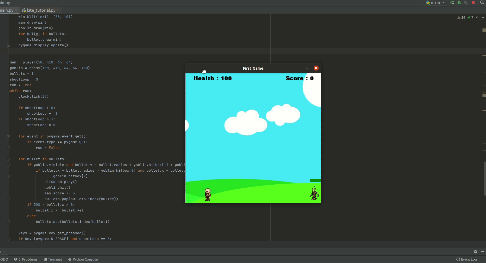

# Basic-shooting-game-using-pygame  
This is a basic 2D shooting game made using pygame.  

Folder requirements contians all the required images and audio files.  
You can start the game by running main.py file. Make sure you have installed pygame before.  
